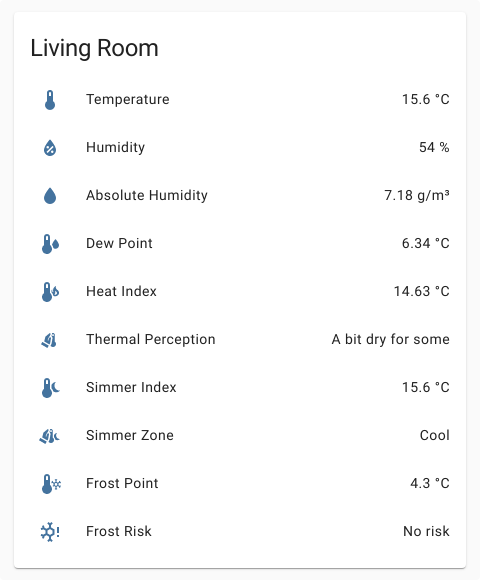

# [](https://github.com/dolezsa/thermal_comfort)
[](https://github.com/hacs/integration)

Thermal Comfort provides the following calculated sensors for Home Assistant.

## Sensors:

<dl>
  <dt><strong>Absolute Humidity</strong></dt>
  <dd>
    Absolute humidity is a measure of the actual amount of water vapor
      (moisture) in the air.
  </dd>
  <dt><strong>Heat Index</strong></dt>
  <dd>
    The heat index combines air temperature and relative humidity to posit a
    human-perceived equivalent temperature.
  </dd>
  <dt><strong>Dew Point</strong></dt>
  <dd>
    The dew point is the temperature to which air must be cooled to become
    saturated with water vapor and dew forms on surfaces.
  </dd>
  <dt><strong>Thermal Perception</strong></dt>
  <dd>
    Human perception of the dew point.
  </dd>
  <dt><strong>Frost Point</strong></dt>
  <dd>
    Frost point, temperature, below 0° C (32° F), at which moisture in the air 
    will condense as a layer of frost on any exposed surface.
  </dd>
  <dt><strong>Frost Risk</strong></dt>
  <dd>
    Risk of Frost based on current temperature, frost point and absolute humidity.
  </dd>
  <dt><strong>Simmer Index</strong></dt>
  <dd>
    An index that combines air temperature and relative humidity. In contrast to
    the Heat Index it describes the human-perceived equivalent temperature at
    night and describes a factor of discomfort.
  </dd>
  <dt><strong>Simmer Zone</strong></dt>
  <dd>
    Human perception of the simmer index.
  </dd>
</dl>



## Usage
To use Thermal Comfort check the documentation for your preferred way to setup
sensors.

**UI/Frontend (Config Flow) [1.4.0](./documentation/config_flow.md) / [master](./documentation/config_flow.next.md)**

**YAML [1.4.0](./documentation/yaml.md) / [master](./documentation/yaml.next.md)**

*Legacy YAML [1.4.0](./documentation/legacy_yaml.md)*

## Installation

### Using [HACS](https://hacs.xyz/) (recommended)

This integration can be installed using HACS. To do it search for Thermal Comfort in the integrations section.

### Manual

To install this integration manually you can either

* Use git:

```sh
git clone https://github.com/dolezsa/thermal_comfort.git
cd thermal_comfort
# if you want a specific version checkout its tag
# e.g. git checkout 1.0.0

# replace $hacs_config_folder with your home assistant config folder path
cp -r custom_components $hacs_config_folder
```

* Download the source release and extract the custom_components folder into your home assistant config folder.

Finally you need to restart home assistant before you can use it.

### Custom Icons

To use Thermal Comfort's custom icon set you have to add the following repository
as [custom frontend](https://hacs.xyz/docs/faq/custom_repositories) integration
in HACS. The icons can then be added within the `tc:` namespace with `tc:sensor-type`.
 e.g. `tc:dew-point`. All names and altervative icons can be found in the repositorys
readme.

https://github.com/rautesamtr/thermal_comfort_icons/
