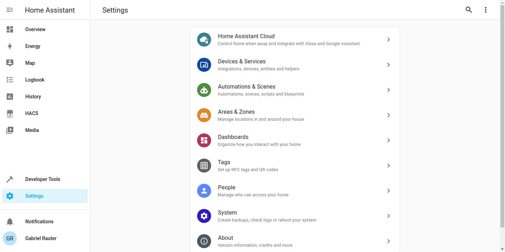
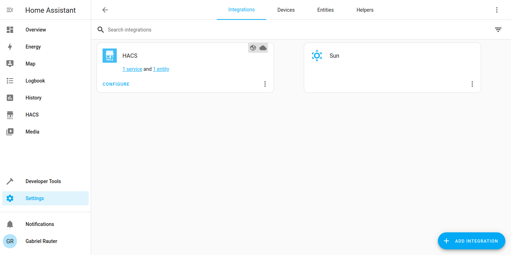
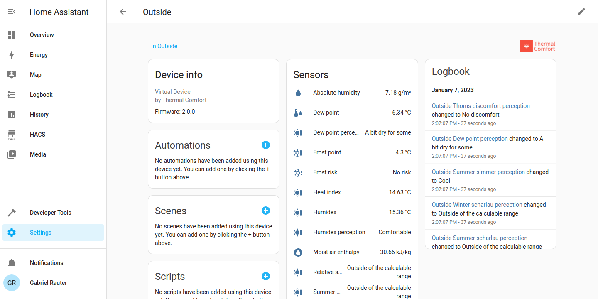
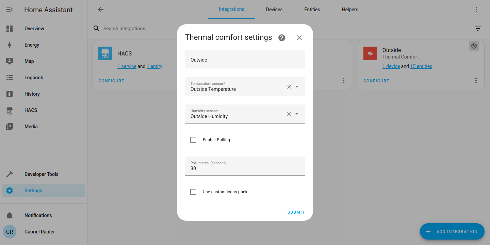

# Initial Configuration
## In your Home Assistant UI go to "Configuration", then click "Devices & Services"

## Make sure Integrations is selected and click the "+" button in the bottom right corner

## Search for or scroll down to find "Thermal Comfort" and select it

## Name your virtual device and select the temperature and humdity sensor you want to use

*Note: Enable [advances mode](https://www.home-assistant.io/blog/2019/07/17/release-96/#advanced-mode)
in your user profile if you want additional options.
We filter the sensors to include only those who have the correct device class.
If you want to select other make sure to enable
[advanced mode](https://www.home-assistant.io/blog/2019/07/17/release-96/#advanced-mode)*

## A virtual device is created to manage your calculated sensors

# Configuration Options

## Click configure on the configuration to set additional options

<dl>
  <dt><strong>Enable Polling</strong> <code>boolean</code></dt>
  <dd>
    Enable this if you want the sensors to be polled. This can avoid double
    calculated values if your input sensors split change updates for humidity
    and temperature.
  </dd>
  <dt><strong>Use custom icons pack</strong>  <code>boolean</code></dt>
  <dd>
    Enable this if you have the <a href="../README.md#custom-icons">custom icon pack</a>
    installed and want to use it as default icons for the sensors
  </dd>
</dl>
